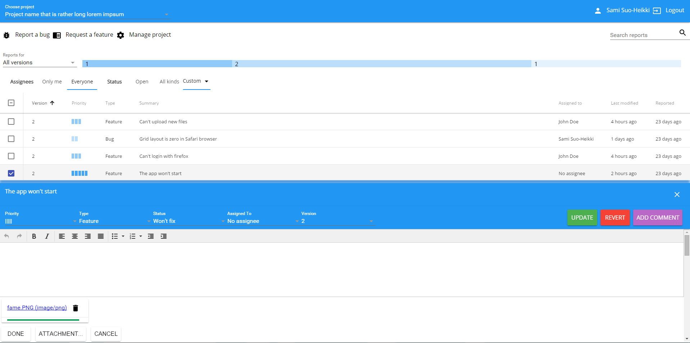

# Vaadin Bugrap Demo

Vaadin Bugrap is a simplistic issue tracking system. This is done as a training project for new employment at [Vaadin](https://www.vaadin.com).

## Demo

Sources for the Vaadin Bugrap https://vaadin-bugrap.firebaseapp.com/. The demo is using [Vaadin Elements](https://www.vaadin.com/elements), [Polymer](http://polymer-project.org) and [Firebase](https://www.firebase.com/).

## Running the app

1. Clone `git clone https://github.com/samiheikki/Vaadin-Bugrap.git`
2. Go into `root` directory and run `bower install`
3. Once finished, run your server
